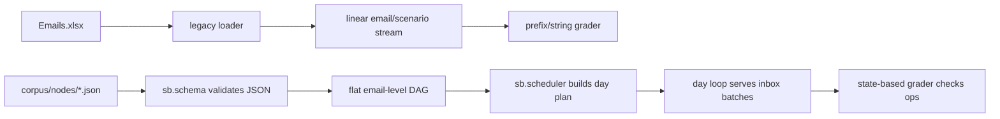
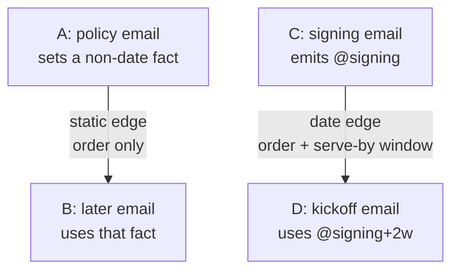

# SecretaryBench DAG transition history

Status: historical note, captured 2026-06-02. For the current specs, read
`docs/design/SERVING_AND_SCHEMA.md`, `ANSWER_KEY_GRAMMAR.md`, and `RUNNING.md`.

## What changed

SecretaryBench moved from the old Excel pipeline plus string-parsing grader into a
seeded DAG benchmark. The old flow treated emails mostly one at a time. The new
flow treats the corpus as a directed acyclic graph of emails, then builds a
deterministic serve plan from dependency state, date anchors, and seeded daily
batching.

The core shift is:



## Anchors

An anchor is a named date value that becomes real when an email is served. Authors
use it so later emails can point to the date by reference instead of carrying a
fixed calendar date in their heads.

Example:

```text
Email A says: "Signing is locked for {!signing=+5d}."
Serve date:   2026-06-01
Anchor:       @signing = 2026-06-06

Email B says: "Book kickoff two weeks after signing."
Answer key:   { "create": "kickoff", "kind": "event", "on": { "eq": "@signing+2w" } }
```

This keeps the email natural for the model and keeps the answer key tied to the
same source of truth. The model never sees tokens. Tokens render into ordinary
dates in the email body, while the grader resolves the same expressions in the
answer key.

## Static edges and date edges

Edges are the scheduler's constraint language.



`static` edges mean "B can rely on a non-date fact from A." They impose ordering,
but no deadline. These are the long-span retrieval lever: A can arrive on day 3
and B can arrive on day 90.

`date` edges mean "B's answer references a date anchor emitted by A." They impose
ordering and a serve-by window. If B's correct answer is `@signing+2w`, B has to be
served before that date would already be in the past.

## Verb actions

The answer key is verb-based now. Each email lists operations on named obligations:
`create`, `move`, or `cancel`.

That matters because obligations can change over time. A later email can say
"move kickoff three business days later" and the answer key can refer to the same
obligation by name:

```json
{ "ops": [ { "move": "kickoff", "on": { "eq": "@kickoff+3bd" } } ] }
```

The obligation name also becomes a node-scoped date anchor after creation, so
later edits can point at the current obligation date without repeating it.

## Day-level calendar model

The benchmark currently grades whole days, not exact times. Times may still appear
in email prose, but date tokens resolve to days and the grader checks the day an
event or todo lands on.

For now, the calendar is allowed to hold any number of events on the same day.
There is no conflict or overlap model. If that assumption stops scaling, conflict
avoidance can be added later as a separate feature instead of mixing it into the
first DAG implementation.

## Daily serving

The scheduler builds a reproducible day-by-day inbox:

- The run is deterministic for the same corpus, start date, seed, and levers.
- Daily batch size is sampled from seeded randomness, currently bounded by the
  scheduler's daily min/max levers.
- Urgent emails are forced earlier when a date edge creates a closing deadline.
- Independent emails can share a day. Dependent emails must arrive on a strictly
  later day than their prerequisites.

This is the new benchmark shape: authored JSON nodes, deterministic DAG serving,
day batches, verb answer keys, and state-based grading.

